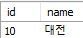
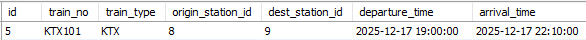
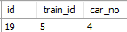
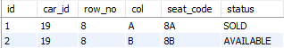

# Database 세팅

## DB : ***train***

## 테이블 요약

- ### stations
  - id (PK) - 기차역 고유 아이디
  - name - 기차역 이름
  -  
- ### trains
  - id (PK) - 기차 고유 아이디
  - train_no - 기차 이름
  - train_type - 기차 종류
  - origin_station_id (FK) - 출발역
  - dest_station_id (FK) - 도착역
  - departure_time - 출발 시간
  - arrival_time - 도착 시간
  - 
- ### cars
  - id (PK) - 호실 고유 아이디
  - train_id (FK) - 기차 고유 아이디
  - car_no - 호차 번호
  - 
- ### seats
  - id (PK) - 좌석 고유 아이디
  - car_id (FK) - 호실 고유 아이디
  - row_no - 좌석 행 번호(1~8)
  - col - 좌석 열 번호(A~D)
  - seat_code - 좌석 번호(1A~8D)
  - status - 좌석 예매 현황 (AVAILABLE, SOLD)
  - 

## 사용 방법
- ### create database train;
- ### use train;
- ### train_ticket.sql 실행